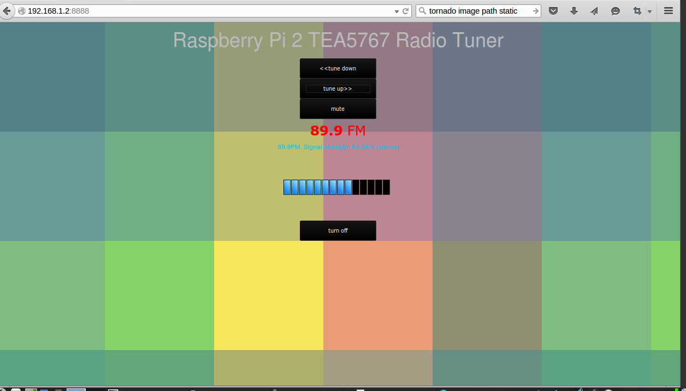

<h1>Raspberry Pi FM receiver using Python 3 I2C and Tea5767</h1>

Contributor: Dipto Pratyaksa
<a href="http://www.linuxcircle.com">LinuxCircle.com</a>

<b>Description:</b>

This is a simple TEA5767 driver to tune into a local radio station
with Raspberry Pi 2. You can either use the console program or run the web interface.

<b>Running on Linux command console:</b>

sudo python3 tea5767controller.py

or with sufficient permission and executable file:
sudo ./tea5767controller.py

<b>Running the Web Interface</b>
 
Run it with: sudo python3 tea5767_tornado_server.py
 
Open browser from a client computer: http://IPADDRESSOFYOURPI:8888
 
Example: http:/192.168.1.2:8888

